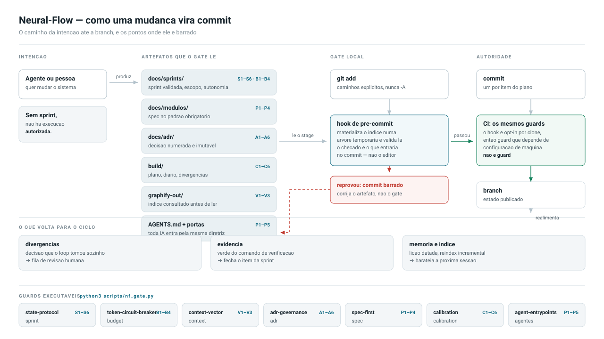

# Neural-Flow Framework

**v0.1.0** · 10 protocolos · 6 guards executaveis · dashboard · MIT

Sistema de Controle Autonomo para engenharia assistida por IA.

> **Instale num projeto:**
>
> ```bash
> bash /caminho/do/neural-flow/install.sh          # detecta o modo sozinho
> ```
>
> Funciona nos dois cenarios: projeto que **ja tem codigo** (instala guards, hooks, CI,
> governanca de agente e liga o smoke-gate, sem sobrescrever nada) e projeto que ainda e
> **so uma ideia** (monta o andaime docs-first, onde a especificacao vem antes da primeira
> linha de codigo). Detalhes em [Instalacao](#instalacao).
>
> **Ou entenda primeiro:** [`docs/GETTING-STARTED.md`](docs/GETTING-STARTED.md) — os mesmos
> passos na mao, em 5 minutos, terminando com um gate bloqueando um commit de verdade.
>
> Mudancas entre versoes: [`CHANGELOG.md`](CHANGELOG.md). Divida conhecida:
> [`ADR-003`](docs/adr/ADR-003-divida-admin-key-vs-rbac.md) — a implementacao de referencia
> Azure ainda usa admin key em vez de Entra ID/RBAC; nenhum protocolo, template ou guard
> depende dela.



O Neural-Flow substitui o modelo de documentacao manual reativa por um sistema operacional de governanca orientado a evidencia, autonomia controlada e memoria institucional.

## Visao

O Neural-Flow transforma mudancas de software em um loop de controle verificavel:

1. definir intencao
2. executar acao
3. medir resultado
4. comparar com criterio
5. corrigir desvio
6. consolidar memoria

Sem medicao e evidencia, nao ha conclusao tecnica.

## Principios do Framework

- governanca por evidencia
- autonomia com limites explicitos
- falha segura por padrao
- memoria como ativo de engenharia
- padrao antes de velocidade
- controle distribuido com verdade unica

## Arquitetura de Governanca

O sistema opera em quatro planos:

1. Politica
   Regras, limites e criterios obrigatorios.

2. Execucao
   Sprints e planos que convertem politica em entrega.

3. Evidencia
   Validacoes, resultados, logs, commits e artefatos.

4. Memoria
   Consolidacao institucional para evitar repeticao de erro.

## Gestao por Deltas e Nao por Narrativas

Regra de ouro para escala de 100+ devs:

- ler Snapshot Operacional da sprint ativa
- ler Delta desde a ultima atualizacao
- executar apenas sobre o que mudou

Em vez de reler historico completo de multiplas sprints, o fluxo privilegia leitura incremental.

Impacto direto:

- reducao de consumo de tokens (FinOps)
- onboarding mais rapido para novos devs e agentes
- menor risco de perda de foco durante execucao

## Diferencial Disruptivo: FinOps de Tokens

No Neural-Flow, tokens sao tratados como custo variavel de engenharia, com orcamento, monitoramento e meta de eficiencia.

Evolucao de disrupcao:

- o Circuit Breaker funciona como disjuntor financeiro em tempo real
- ao detectar alucinacao operacional (loops caros) ou estouro de budget, o fluxo corta a API de IA imediatamente
- o FinOps sai de revisao semanal e vira trava ativa de seguranca financeira

### Estrategia de Tiers de Modelos

Uso recomendado por classe de tarefa:

- Tier Leve: triagem, leitura incremental, classificacao, atualizacao de delta e tarefas repetitivas
- Tier Intermediario: analise de impacto, revisao de consistencia, composicao de entregas
- Tier Avancado: arquitetura, decisao critica, investigacao complexa e refatoracao de alto risco

Regra de eficiencia:

- usar tier mais barato que atenda qualidade minima
- escalar para tier superior apenas quando complexidade justificar

### KPIs de Negocio para IA

O custo de tokens deve ser conectado ao throughput de entrega para medir produtividade liquida real.

KPIs minimos:

- custo de tokens por sprint
- custo de tokens por item concluido
- throughput de itens concluidos por sprint
- produtividade liquida por token

Formula recomendada de produtividade liquida:

- produtividade liquida = itens concluidos validos / tokens consumidos

## Documentacao como Contexto Funcional

No Neural-Flow, cada arquivo de governanca e contexto executavel para LLM e para humanos.

Diferenca pratica em relacao ao modelo tradicional de backlog:

- documentacao nao e arquivo morto
- documentacao define limite operacional da execucao
- documentacao fornece trilha objetiva para decisao e validacao

Isso garante que agente e time operem com objetivo, escopo e criterio de pronto explicitos.

## Sprint-Primeiro como Trava de Seguranca

Nenhuma execucao tecnica comeca sem sprint validada.

Essa regra evita que a IA opere sem contexto minimo e reduz mudancas fora de escopo.

Combinada com memoria de sessao e atualizacao por delta, ela evita explosao de tokens e reduz tempo de retomada entre sessoes.

## Niveis de Autonomia

- A0: manual assistido
- A1: execucao supervisionada
- A2: execucao semi-autonoma
- A3: execucao autonoma controlada

Regra de seguranca: mudancas em auth, segredos, dados sensiveis, infraestrutura, billing e integracoes externas devem operar em A0 ou A1, salvo excecao formal.

## Protocolo Canonico de Mudanca

Toda mudanca segue estas etapas:

1. contextualizar
2. planejar
3. executar
4. validar
5. evidenciar
6. consolidar memoria
7. encerrar

Uma mudanca so pode ser marcada como concluida quando os gates obrigatorios forem atendidos e houver evidencia minima verificavel.

## Protocolos Nucleares Implementados

Os protocolos estao implementados e versionados em `docs/protocols/`.

| Protocolo                             | Objetivo operacional                               | Arquivo                                 |
| ------------------------------------- | -------------------------------------------------- | --------------------------------------- |
| Protocolo de Estado (State Protocol)  | Bloquear execucao sem sprint validada              | docs/protocols/state-protocol.md        |
| Circuit Breaker (Disjuntor de Tokens) | Monitorar budget de tokens e interromper anomalias | docs/protocols/token-circuit-breaker.md |
| Vetor de Contexto do Repositorio      | Garantir decisao ancorada em contexto verificavel  | docs/protocols/context-vector.md        |
| Evidencia Sintetica                   | Exigir prova tecnica para fechar itens             | docs/protocols/synthetic-evidence.md    |
| Aegis Protocol (Seguranca)            | Aplicar classificacao de dados e zero segredo      | docs/protocols/aegis-security.md        |
| Neural-Memory (RAG)                   | Recuperacao semantica em vez de leitura linear     | docs/protocols/neural-memory.md         |
| ADR Governance                        | Decisao arquitetural numerada, imutavel, auditavel | docs/protocols/adr-governance.md        |
| Spec-First                            | Especificar e passar em gate antes de codificar    | docs/protocols/spec-first.md            |
| Loop Autonomo                         | Execucao prolongada com estado em disco            | docs/protocols/autonomous-loop.md       |
| Calibracao e Incerteza                | Grau de certeza explicito, derivado de evidencia   | docs/protocols/calibration.md           |

Guia consolidado:

- docs/protocols/README.md
- docs/protocols/auditoria-mensal-template.md

## Arquitetura Tecnica e Persistencia

O Neural-Flow nao usa banco de dados relacional. Nao ha SQL, schema, migrations, ORM
nem stored procedures em nenhum ponto do sistema — por decisao de arquitetura, nao por
pendencia de implementacao.

A persistencia opera em duas camadas:

| Camada                | Onde vive                          | Papel                                                       |
| --------------------- | ---------------------------------- | ----------------------------------------------------------- |
| Fonte da verdade      | Arquivos markdown versionados (git) | Politica, sprints, evidencias e memoria institucional        |
| Indice derivado (RAG) | Backend vetorial a escolha do projeto | Busca hibrida keyword + vetorial sobre a fonte da verdade |

O protocolo Neural-Memory e **backend-agnostico**: define contratos (indexacao,
busca hibrida, MCP tools, reindex incremental), nao tecnologia. Este repo traz a
implementacao de referencia em Azure AI Search + Azure OpenAI (Python); projetos
que ja possuem PostgreSQL devem preferir pgvector no proprio banco (padrao
validado em campo). Ver `docs/protocols/neural-memory.md`.

Consequencias praticas:

- o indice e sempre reconstruivel a partir do git; nunca e fonte primaria
- consultas usam a API de busca do SDK Azure (`SearchClient`, `VectorizedQuery`), nao query language relacional
- embeddings sao gerados por Azure OpenAI (`text-embedding-3-small`)
- reindexacao roda por hook local e por GitHub Actions (`.github/workflows/reindex.yml`)

Componentes de codigo:

| Componente                        | Funcao                                                                  |
| --------------------------------- | ----------------------------------------------------------------------- |
| scripts/ingest.py                 | Chunk de docs, git log e logs de sessao; embeddings; upload para o indice |
| scripts/search.py                 | CLI de busca hibrida com filtros por tipo e sprint                       |
| mcp/neural-memory-server/server.py | Servidor MCP: `query_neural_memory` e `check_contradiction`             |
| infra/terraform/                  | Provisionamento do Azure AI Search e Azure OpenAI                        |

## Estrutura Deste Repositorio

```text
.
|-- LICENSE
|-- README.md
|-- .github/
|   |-- workflows/reindex.yml
|   `-- prompts/
|-- docs/
|   |-- Manifest-Dev-AI.md
|   |-- NEURAL-MEMORY.md
|   |-- MEMORY.md
|   |-- SPRINTS-MVP.md
|   `-- protocols/
|       |-- README.md
|       |-- state-protocol.md
|       |-- token-circuit-breaker.md
|       |-- context-vector.md
|       |-- synthetic-evidence.md
|       |-- aegis-security.md
|       |-- neural-memory.md
|       `-- auditoria-mensal-template.md
|-- scripts/
|   |-- ingest.py
|   |-- search.py
|   |-- validate_calibration.py
|   `-- setup-hooks.sh
|-- mcp/
|   `-- neural-memory-server/server.py
|-- infra/
|   `-- terraform/
`-- templates/
    |-- sprint-template.md
    |-- SPRINTS-CHECKLIST-TEMPLATE.md
    |-- memoria-sessao-sprint-template.md
    |-- AGENTS-template.md
    |-- AI_SAFETY-template.md
    |-- MEMORY-template.md
    |-- adr-template.md
    |-- playbook-rollback-template.md
    |-- runbook-incidente-template.md
    |-- spec-modulo-template.md
    |-- githooks/pre-commit
    `-- loop/
        |-- PROTOCOLO-template.md
        |-- PLANO-template.md
        |-- DIARIO-template.md
        |-- DIVERGENCIAS-template.md
        `-- PROMPT-LOOP-template.md
```

## Kit de Adocao em Novo Projeto

Para aplicar o Neural-Flow em qualquer projeto, copiar e preencher:

| Template                                  | Vira no projeto                | Papel                                                      |
| ----------------------------------------- | ------------------------------ | ---------------------------------------------------------- |
| templates/AGENTS-template.md              | `AGENTS.md` (raiz)             | Fonte de verdade tool-agnostica para qualquer LLM; principio "documentacao orienta, guard obriga" |
| templates/CLAUDE-template.md              | `CLAUDE.md` (raiz)             | Principios de execucao (Karpathy) amarrados aos protocolos que os tornam verificaveis |
| templates/AI_SAFETY-template.md           | `.github/AI_SAFETY.md`         | Proibicoes absolutas e acoes com confirmacao (Aegis operacional) |
| templates/MEMORY-template.md              | `MEMORY.md` (raiz)             | Memoria viva: decisoes, padroes e Solutions Log datado     |
| templates/adr-template.md                 | `docs/adr/ADR-NNN-*.md`        | Registro de decisao arquitetural                           |
| templates/sprint-template.md              | sprint ativa                   | Checklist executavel; commits `Sprint N - ...`             |
| templates/playbook-rollback-template.md   | `docs/playbooks/ROLLBACK-*.md` | Rollback escrito antes do deploy                           |
| templates/runbook-incidente-template.md   | `docs/playbooks/SRE-*.md`      | Diagnostico/remediacao por modo de falha                   |
| templates/spec-modulo-template.md         | `docs/modulos/NN-*/`           | Spec no padrao obrigatorio, validada por gate              |
| templates/loop/PROTOCOLO-template.md      | `build/PROTOCOLO.md`           | Regras de UMA iteracao do loop autonomo                    |
| templates/loop/PLANO-template.md          | `build/PLANO.md`               | Backlog + Definicao de Pronto + escopo negativo            |
| templates/loop/DIARIO-template.md         | `build/DIARIO.md`              | Rastro cronologico por iteracao                            |
| templates/loop/DIVERGENCIAS-template.md   | `build/DIVERGENCIAS.md`        | Decisoes que o loop tomou sozinho — revisao humana         |
| templates/loop/PROMPT-LOOP-template.md    | `build/PROMPT-LOOP.md`         | Folha de operacao do humano que dispara o loop             |
| templates/githooks/pre-commit             | `.githooks/pre-commit`         | Gates rodando sobre o stage a cada commit                  |
| scripts/validate_calibration.py           | `scripts/`                     | Guard executavel do protocolo de Calibracao                |
| scripts/nf_dashboard.py                   | `scripts/`                     | Dashboard HTML auto-contido do estado da governanca        |
| scripts/nf_diagrama.py                    | `scripts/`                     | Gera o diagrama de arquitetura a partir do registro de guards |
| scripts/nf_agentes.py                     | `scripts/`                     | Corpo canonico das portas de entrada de agente (uma fonte, muitas portas) |
| scripts/nf_indice_regras.py               | `scripts/`                     | Gera `.neural-flow/indice-regras.{md,json}` — uma linha por regra, com fonte e guard |
| scripts/validate_agent_entrypoints.py     | `scripts/`                     | Guard das portas de entrada e do indice de regras |

Playbook pronto (nao e template, ja e generico): `docs/playbooks/guardrails-ia-infra-producao.md` — guardrails para IA operar infraestrutura de producao (modos de operacao, gates de plan, sinais de STOP, RACI, prompt padrao).

## Camada de Guards — smoke-gate

Principio n. 0 do framework: **documentacao orienta, guard obriga**. Uma diretriz sem
guard automatizado depende de qual modelo leu o que — e por isso ainda nao esta pronta.

O [`smoke-gate`](https://github.com/reimon/smoke-gate) e o guard de referencia do
Neural-Flow para projetos com HTTP + banco relacional. Ele bate todos os endpoints
contra um DB real e bloqueia o deploy se algum retornar 500, alem de rodar um scanner
estatico que pega drift entre SQL e schema antes da producao.

### Instalacao

O pacote nao esta no registry publico do npm — instalar direto do GitHub, sempre com tag fixa:

```bash
npm install -D "github:reimon/smoke-gate#v0.5.0"
```

### Os quatro modos de uso

| Modo | Comando / config | Papel no Neural-Flow |
| --- | --- | --- |
| Audit estatico | `npx smoke-gate audit --llm none` | Evidencia Sintetica: relatorio deterministico sem mudar nada no repo |
| Runtime gate | `defineSmokeSuite({...})` em `*.smoke.test.ts` | Evidencia Sintetica: prova de que endpoint responde contra DB real |
| MCP server | ja registrado em `.vscode/mcp.json` | Vetor de Contexto: `audit_check_sql` valida SQL contra o schema em <50ms **antes** do agente gerar a query |
| GitHub Action | `uses: reimon/smoke-gate/action@v0.5.0` | Circuit Breaker de qualidade: bloqueia merge em finding `critical` |

### Detectores

`sqlDrift` (coluna que nao existe nas migrations), `authGaps` (rota com `:userId` sem
ownership), `errorLeak` (`err.message` em resposta 5xx), `unsafeJsonParse`,
`dbMockInTest` (mock de pool escondendo drift), `raceCondition` (SELECT+INSERT sem
transacao), `smokeCoverage` (endpoint sem smoke test).

### Onde entra no ciclo canonico de mudanca

1. **Executar** — agente chama `audit_check_sql` (MCP) antes de escrever SQL.
2. **Validar** — `npx smoke-gate audit --since origin/main` roda so no diff do PR.
3. **Evidenciar** — `audit-report.md` (ou saida `--json`) e o artefato anexado ao item.
4. **Encerrar** — Action com `fail-on: critical` impede que a sprint feche com regressao.

Limite atual (v0.5): detectores sao TypeScript/Node + Postgres. Suporte polyglot
(Python/Go/Ruby via Treesitter) esta no roadmap v0.6 — ate la, projetos Python usam
apenas os modos audit generico e MCP.

## Arquivos Canonicos

| Arquivo                                     | Papel                                                    |
| ------------------------------------------- | -------------------------------------------------------- |
| docs/Manifest-Dev-AI.md                     | Manifesto principal e regras obrigatorias do Neural-Flow |
| docs/NEURAL-MEMORY.md                       | Seed document do banco vetorial — memoria institucional  |
| docs/SPRINTS-MVP.md                         | Sprint de baseline para iniciar governanca no projeto    |
| docs/protocols/README.md                    | Matriz operacional dos 10 protocolos + checklist de auditoria |
| docs/protocols/neural-memory.md             | 6o protocolo — RAG vetorial + MCP                        |
| docs/protocols/auditoria-mensal-template.md | Modelo oficial de auditoria mensal dos protocolos        |

## Instalacao

```bash
bash /caminho/do/neural-flow/install.sh                      # no diretorio do projeto
bash /caminho/do/neural-flow/install.sh --name "Meu App"     # nomeia o projeto
./install.sh --target ../meu-projeto --mode greenfield       # do clone do framework
./install.sh --target . --dry-run                            # mostra sem escrever
```

Requisitos: `git` e `python3` (3.10+). Nenhuma dependencia a instalar — os guards sao
stdlib pura (ADR-002).

### Dois modos, detectados sozinhos

| Modo | Quando | O que instala |
| ---- | ------ | ------------- |
| **brownfield** | O projeto ja tem codigo (`package.json`, `src/`, `pyproject.toml`...) | Guards + hook + CI, `AGENTS.md`, `CLAUDE.md`, `.github/AI_SAFETY.md`, `MEMORY.md`, **as portas de entrada de todo agente**, o indice de regras, sprint de adocao e o smoke-gate |
| **greenfield** | O projeto ainda e uma ideia | Tudo do brownfield **mais** o andaime docs-first: `COMECE-AQUI.md`, padrao de especificacao, `docs/modulos/`, `docs/adr/`, e os arquivos de estado do loop em `build/` |

O modo greenfield existe para o caso "tenho uma ideia de aplicativo": o repositorio nasce
**sem codigo e com spec**, e o codigo so comeca quando `nf_gate.py spec` passa. E o metodo
que produz sistema verificavel em vez de demo — com geracao assistida, escrever codigo e a
parte barata; o caro e decidir o que construir e impedir que o agente preencha o vazio com
o que soa razoavel.

### smoke-gate incluido

O instalador liga o [`smoke-gate`](https://github.com/reimon/smoke-gate) por padrao:

- **MCP em qualquer stack** (`.mcp.json` e `.vscode/mcp.json`) — o agente chama
  `audit_check_sql` para validar SQL contra o schema em <50ms **antes** de gerar a query;
- **devDependency + script `audit` + Action** quando existe `package.json` — os detectores
  cobrem Node/TS + Postgres, entao a dependencia so entra onde faz sentido.

**Sempre a versao mais recente.** O instalador consulta as tags do smoke-gate e grava a
mais nova no projeto. Nao ha versao fixada no codigo do framework: publicou v0.6, a
proxima instalacao ja usa v0.6, sem release nossa. A versao resolvida e **gravada** no
projeto — referencia flutuante faria o mesmo commit auditar diferente em dias diferentes.

```bash
--smoke-gate-ref main      # acompanhar o branch, sem pinagem
--smoke-gate-ref v0.5.0    # congelar numa versao
--smoke-gate no            # nao instalar
```

Sem rede, cai para a ultima versao conhecida e avisa — instalacao nunca falha por isso.

### Qualquer agente, a mesma diretriz

Cada ferramenta de IA le um arquivo diferente na raiz. Um projeto que so tem `CLAUDE.md`
esta governado para exatamente um agente — todo o resto entra sem diretriz e reimplementa
o que ja existe. O instalador escreve **uma porta de entrada por ferramenta**, todas
geradas do mesmo corpo canonico (`scripts/nf_agentes.py`):

| Arquivo | Quem le |
| --- | --- |
| `AGENTS.md` | **Fonte de verdade.** Codex, Jules, Devin e Factory leem direto daqui |
| `CLAUDE.md` | Claude Code — ancora: carrega os principios de execucao |
| `GEMINI.md` | Gemini CLI, Gemini Code Assist |
| `.github/copilot-instructions.md` | GitHub Copilot |
| `.cursor/rules/neural-flow.mdc` | Cursor (`alwaysApply: true`) |
| `.clinerules` · `.windsurfrules` | Cline · Windsurf |
| `AGENT.md` · `CONVENTIONS.md` · `HERMES.md` | Amp/Zed · Aider · Hermes/OpenClaw |

Uma fonte, muitas portas: as portas **nao se editam** — apontam para `AGENTS.md` e
carregam so as cinco regras que valem antes de qualquer leitura. Nove copias da mesma
diretriz divergem na terceira edicao, e a partir dai cada agente segue uma versao
diferente do projeto. O guard `agentes` trava porta ausente, porta divergente e porta que
aponta para arquivo inexistente. Projeto brownfield que ja tinha instrucoes proprias tem
as diretrizes **anexadas**, nunca sobrescritas.

Ferramenta nova entra com uma linha em `PORTAS`, em `scripts/nf_agentes.py`. Para regerar
as portas depois de mudar `AGENTS.md`:

```bash
python3 scripts/nf_agentes.py --escrever
```

Este comando toca so as portas — `nf_install.py --force` sobrescreveria tambem o
`AGENTS.md` e o `MEMORY.md` preenchidos pelo time.

Protocolo: `docs/protocols/agent-entrypoints.md`.

### Indice de regras: o que o agente le antes de tudo

A primeira instrucao de toda porta e consultar o indice antes de ler — regra de entrada do
Vetor de Contexto. Para que ela nao aponte para o vazio, o instalador gera
`.neural-flow/indice-regras.md` (e `.json`): **uma linha por regra**, com a fonte
(`arquivo:linha`) e o guard que a trava, extraidas de `AGENTS.md`, `AI_SAFETY.md`,
`CLAUDE.md`, `docs/protocols/`, `docs/adr/` e `MEMORY.md`.

Deterministico e em stdlib pura (ADR-002): existe no minuto zero, sem rede e sem LLM, e
continua valendo quando o grafo do `graphify` nao subiu. Quando o grafo sobe, o indice
entra como corpus — as regras viram nos com fonte rastreavel, e a consulta passa a ser
`graphify query`, com o `.md` como fallback. O JSON grava a impressao digital das fontes:
mudou um documento de governanca e ninguem regerou, o guard trava.

```bash
python3 scripts/nf_indice_regras.py           # regera
python3 scripts/nf_indice_regras.py --check   # exit 1 se desatualizado
```

### Disciplina do agente: CLAUDE.md

O instalador escreve um `CLAUDE.md` com os quatro principios de execucao de
[andrej-karpathy-skills](https://github.com/multica-ai/andrej-karpathy-skills) — Think
Before Coding, Simplicity First, Surgical Changes, Goal-Driven Execution — e amarra cada
um ao protocolo que o torna verificavel:

| Principio | Protocolo que o trava |
| --- | --- |
| Think Before Coding | Spec-First — duvida vira divergencia registrada, nunca preenchimento plausivel |
| Simplicity First | Vetor de Contexto — nao reimplementar o que `AGENTS.md` ja lista |
| Surgical Changes | Loop Autonomo — um item por iteracao, commit escopado |
| Goal-Driven Execution | Evidencia Sintetica — verde e a unica condicao para marcar pronto |

Os principios sao a disciplina; os protocolos sao a trava. Um sem o outro nao segura.

### Garantias

- **Nao sobrescreve nada.** Arquivo existente e mantido e reportado; `package.json` tem
  apenas a dependencia e o script acrescentados. `--force` sobrescreve.
- **Idempotente.** Rodar de novo nao duplica.
- **Auto-valida.** Ao terminar, roda `nf_gate.py` no projeto instalado. Se o que ele
  gerou nao passa no proprio gate, o instalador **falha e diz que o bug e dele**, nao seu.
  Coberto por teste: `test_greenfield_gera_projeto_que_passa_no_gate`.

## Dashboard

```bash
python3 scripts/nf_dashboard.py --open
```

Le os artefatos do repositorio e gera **um HTML auto-contido** com o estado da governanca:
sprint ativa e progresso, os 6 guards executados na hora, FinOps de tokens (orcamento x
consumo por sprint), smoke-gate (versao e ultimo audit), o indice de conhecimento (nos,
arestas, comunidades, arestas AMBIGUOUS), o loop (progresso, divergencias pendentes,
confianca declarada por iteracao) e a tabela de protocolos separando o que **trava** do que
se **audita**.

**Consumo real de tokens.** O dashboard le os transcripts locais do Claude Code e do Codex e mostra o
consumo **medido** ao lado do **declarado** na sprint — entrada, saida, escrita e leitura de
cache, por modelo e por dia, mais o aproveitamento de cache. Sem isso, o FinOps dependia
inteiramente de alguem lembrar de anotar.

Alem do consumo, o dashboard mostra **como o trabalho se distribuiu**: mapa de calor de
requisicoes por hora e por dia, ferramentas mais chamadas pelo agente, e as sessoes mais
caras com duracao. Bloco longo e continuo custa menos que muitas sessoes curtas — o cache
sobrevive dentro da sessao e morre entre elas.

**Multi-provedor.** Le tambem os rollouts do **Codex** (`~/.codex/sessions`), filtrando
pelo diretorio do projeto — o Codex organiza sessoes por data, nao por projeto, entao sem
esse filtro o numero seria de todos os seus projetos somados. Quando ha mais de um
provedor, o dashboard mostra a divisao entre eles.

O **Antigravity** ficou de fora por impossibilidade tecnica, nao por escolha: o historico
local dele (`~/.gemini/antigravity-cli/history.jsonl`) registra apenas workspace e horario,
sem token algum. Ler seu consumo exigiria falar um protocolo RPC nao documentado com o app
em execucao.

> **Privacidade.** So numeros sao lidos: contagem de tokens, modelo, carimbo de tempo, identificador de
> sessao e o **nome** das ferramentas chamadas — nunca com que argumentos. **O conteudo das mensagens nunca e lido nem gravado**, e nada
> sai da sua maquina. A varredura fica restrita ao diretorio do projeto analisado.

```bash
python3 scripts/nf_tokens.py --dias 30    # so a telemetria, no terminal
```

Nao ha valor em dinheiro de proposito: precos mudam e variam por plano, entao exibir custo
estimado seria inventar precisao que nao temos. Tokens sao o que o sistema mede de fato.

**Ajuda contextual.** Cada quadro, cada um dos 10 protocolos e cada indicador do topo tem
um botao **?** que abre uma janela explicando o que aquilo e, o que representa e o que fazer
quando reprova. Usa o `popover` nativo do HTML — janela de verdade, com `Esc` e clique-fora,
**sem uma linha de JavaScript**. Um modal com script quebraria a garantia de auto-contencao.

O card do indice de conhecimento **linka os artefatos do graphify** — `graph.html`
(grafo interativo, force-directed, com filtro por comunidade), a wiki e o
`GRAPH_REPORT.md` —, com o tamanho de cada um. Sao links, nao embutidos: `graph.html`
costuma passar de 2 MB, e embuti-lo destruiria a promessa de arquivo unico e leve. O
caminho e calculado a partir de onde a pagina e gravada.

**Ver antes de instalar:** [`docs/dashboard-demo.html`](docs/dashboard-demo.html) e uma
demonstracao versionada, gerada a partir de `tests/fixtures/demo/` — abra o arquivo no
navegador (ou publique `docs/` no GitHub Pages). Um teste regenera a pagina e reprova se
ela deixar de refletir o gerador, para a demo nao apodrecer.

Nao e servidor. Nenhum CDN, nenhum JavaScript de terceiros, nenhuma dependencia a instalar
— mesma regra do ADR-002. Abre offline, roda no CI, publica no GitHub Pages.

```bash
python3 scripts/nf_dashboard.py --out docs/dashboard.html   # para publicar
python3 scripts/nf_dashboard.py --root ../outro-projeto     # outro repo
```

Por padrao grava em `.neural-flow/dashboard.html`, que o instalador ja adiciona ao
`.gitignore` — o dashboard e derivado, reconstruivel a qualquer momento a partir dos
artefatos.

Sobre as cores: a paleta e a do metodo de dataviz, **validada por script** nos dois modos
(banda de luminosidade, piso de croma, separacao para daltonismo e contraste contra a
superficie). Status nunca aparece so como cor — sempre icone + rotulo. Toda barra carrega
rotulo direto com o valor.

## O Que Muda no Comportamento do Agente

Este e o contrato do framework: depois da adocao, o agente passa a operar assim — e cada
item tem um protocolo que o garante, nao uma recomendacao que o sugere.

| O agente... | Como o framework garante |
| ----------- | ------------------------ |
| **Planeja** antes de agir | State Protocol bloqueia execucao sem sprint validada; `PLANO.md` traz Definicao de Pronto, ordem por dependencia e escopo negativo declarado |
| **Possui indice** | Neural-Memory (RAG backend-agnostico) + grafo de conhecimento versionado; indice sempre reconstruivel do git |
| **Sabe escolher ferramentas** | Tabela classe de pergunta x ferramenta no Vetor de Contexto; escalada sempre da mais barata que responde; `grep` para "entender" e anti-padrao declarado |
| **Le apenas o necessario** | Indice antes de leitura (48x menos tokens), gestao por deltas, teto de 50% de contexto, fatia de subagente dimensionada por volume de conteudo |
| **Valida antes de responder** | Evidencia Sintetica (verde e a unica condicao), smoke-gate, `check_contradiction` antes de agir, `audit_check_sql` antes de gerar SQL |
| **Mede confianca** | Calibracao: nivel ALTA/MEDIA/BAIXA **derivado da classe de evidencia**, declarado em toda conclusao; item nunca fecha com BAIXA — com guard executavel (`scripts/validate_calibration.py`) |
| **Sabe quando perguntar de novo** | Gatilho de reconsulta (indice fraco ⇒ reformular, nao varrer) + gatilho de irreversibilidade (BAIXA + irreversivel ⇒ parar e perguntar) |
| **Aprende com execucoes anteriores** | Solutions Log datado, `DIVERGENCIAS.md`, reindex incremental, regra "fim de agente arruma a casa para o proximo" |
| **Nao inventa dado de dominio** | Spec-First: dado ausente bloqueia o item; nunca vira valor plausivel |
| **Nao contradiz decisao vigente** | ADR imutavel + `check_contradiction` com BLOCK acionando o Circuit Breaker |
| **Nao expoe segredo nem destroi producao** | Aegis + `AI_SAFETY.md`: proibicoes absolutas e acoes que exigem confirmacao |

Checklist de auditoria por protocolo: `docs/protocols/README.md`.

### Guards executaveis — o que trava, nao o que sugere

Principio n. 0: **documentacao orienta, guard obriga.** Diretriz sem guard depende de qual
modelo leu o que — e por isso ainda nao esta pronta.

Um comando roda todos:

```bash
python scripts/nf_gate.py            # todos os guards
python scripts/nf_gate.py sprint adr # so os indicados
python scripts/nf_gate.py --list     # o que existe e o que cada um garante
```

| Guard | Protocolo que torna executavel | O que trava |
| ----- | ------------------------------ | ----------- |
| `nf_gate.py sprint` | State Protocol (S1-S6) | Snapshot incompleto, status ambiguo, **escopo sensivel operando em A2/A3**, escopo sem fronteira, sprint "concluida" com item aberto |
| `nf_gate.py budget` | Circuit Breaker (B1-B4) | Sprint sem token budget, sem consumo registrado, ou estourando o budget sem mitigacao/excecao formal |
| `nf_gate.py context` | Vetor de Contexto (V1-V3) | Referencia pendurada, decisao sem fonte citada, sprint concluida sem evidencia real |
| `nf_gate.py adr` | ADR Governance (A1-A6) | Numero duplicado, supersecao apontando para ADR inexistente, **ciclo de supersecao**, ADR aceito sem sprint de origem ou sem guard declarado |
| `nf_gate.py spec` | Spec-First (P1-P4) | Spec sem secao obrigatoria, secao so com placeholder, invariante sem ID, aceite nao numerado |
| `nf_gate.py calibration` | Calibracao (C1-C6) | Conclusao sem confianca declarada, item fechado com BAIXA, divergencia irreversivel registrada em vez de perguntada |
| `smoke-gate audit` / Action | Evidencia Sintetica | Drift SQL, IDOR, error leak, endpoint sem cobertura |

Instalacao num projeto (qualquer stack — os guards sao Python stdlib puro, sem `pip install`):

```bash
cp <neural-flow>/scripts/nf_*.py <neural-flow>/scripts/validate_*.py scripts/
cp <neural-flow>/templates/githooks/pre-commit .githooks/pre-commit
cp <neural-flow>/.github/workflows/neural-flow-gates.yml .github/workflows/
chmod +x .githooks/pre-commit
git config core.hooksPath .githooks
```

### Projeto que ja tem um validador com o mesmo nome

Se o seu `scripts/` ja tem um `validate_module_spec.py` (ou qualquer homonimo), o
instalador **nao o sobrescreve** — instala o nosso ao lado, como `nf_validate_module_spec.py`,
e avisa. O `nf_gate` distingue os dois por uma assinatura de origem no arquivo, entao ele
nunca chama o script do projeto com os nossos argumentos.

Para o gate rodar **tambem** o seu validador, diga a ele como:

```json
{
  "guards": {
    "spec": {
      "comando": ["python3", "scripts/validate_module_spec.py", "--module", "{modulo}", "--root", "docs/modulos"],
      "por_modulo": "docs/modulos/modulo-*"
    }
  }
}
```

`{root}` vira a raiz do projeto e `{modulo}` o numero extraido do nome do diretorio.
Sem `por_modulo`, o comando roda uma vez so. Reprovacao do seu validador reprova o gate,
como qualquer outro.

Ajuste fino por projeto em `.neural-flow.json` (secoes de spec, globs) e via
`NF_GUARDS="sprint adr"` para rodar um subconjunto no hook.

**O guard nao atrapalha quem nao usa o protocolo, e trava quem usa errado**: projeto sem
sprints, sem ADRs ou com templates ainda nao preenchidos passa direto (exit 0). O hook
valida **o que esta em stage**, materializando o indice numa arvore temporaria — o que e
checado e exatamente o que entraria no commit.

## Ordem de Construcao de um Projeto Novo

A ordem importa mais que qualquer ferramenta desta lista. Validada em campo (projeto
um projeto de dominio regulado especificou todos os seus modulos e construiu a base de
conhecimento **antes** da primeira linha de codigo de produto).

| Etapa | Artefato | Gate |
| ----- | -------- | ---- |
| 1. Especificar | Specs no padrao obrigatorio (`templates/spec-modulo-template.md`) | Validador executavel no pre-commit |
| 2. Inventariar | Mapa de cobertura: ativos reutilizaveis x modulos especificados | Decisao registrada; adocao adiada conscientemente |
| 3. Indexar | Grafo de conhecimento + wiki + relatorio (`graphify`) | Consulta ao indice antes de qualquer leitura |
| 4. Planejar | `build/PLANO.md` com criterio de aceite por item | Definicao de Pronto explicita e verificavel |
| 5. Construir | Loop autonomo, uma iteracao por item | Comando de verificacao verde |
| 6. Registrar | Diario, divergencias, memoria, indice atualizado | Fim de agente arruma a casa para o proximo |

Por que esta ordem:

- **Especificar antes de inventariar** — inventario sem spec produz reuso ruim (adota-se o
  que existe, nao o que se precisa).
- **Indexar antes de especificar** indexa o vazio.
- **Construir antes de planejar** produz codigo que ninguem consegue verificar — e num
  projeto assistido por IA, codigo nao verificavel e o unico tipo que se produz rapido
  demais para ser revisado.

A tese por tras: com geracao assistida, **escrever codigo e a parte barata**. O caro e
decidir o que construir, provar que a decisao esta registrada e impedir que o agente
invente. Quando a spec esta pronta, o codigo sai dela; quando nao esta, o agente preenche
o vazio com o que soa razoavel — e em dominio regulado, "soar razoavel" e o modo de falha
mais caro que existe.

## Fluxo de Uso Recomendado

1. Ler docs/Manifest-Dev-AI.md para entender politicas, gates e estrutura de sprint.
2. Consultar memoria institucional via `query_neural_memory` (MCP) ou `python scripts/search.py "<consulta>"`.
3. Usar docs/SPRINTS-MVP.md como base para abrir ou evoluir uma sprint.
4. Executar mudancas somente apos registro da sprint.
5. Encerrar sprint apenas com validacoes e evidencias completas.

## Criterio de Qualidade Operacional

Uma sprint de qualidade no Neural-Flow precisa conter, no minimo:

- snapshot operacional atualizado
- checklist numerado
- validacoes registradas
- evidencias por item concluido
- commits executados
- resumo das atividades
- pendencias da proxima iteracao

## Regra de Conflito

Quando houver conflito:

- entre velocidade e controle, prevalece o controle
- entre opiniao e evidencia, prevalece a evidencia
- entre automacao e seguranca, prevalece a seguranca

## Evolucao do Framework

O manifesto e vivo. Toda melhoria de governanca deve registrar:

1. problema observado
2. regra proposta
3. impacto esperado
4. data de adocao
